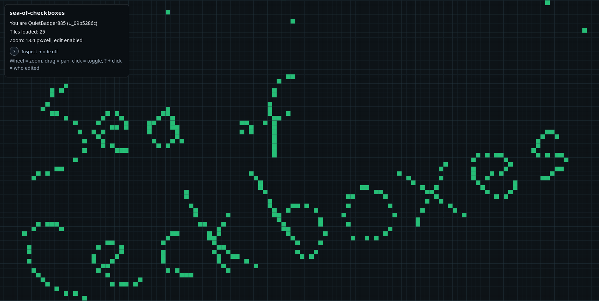

### Sea of Checkboxes

A web app that lets users share a large board of checkboxes.  Can you do pixel art on this? Yes.  Can you fight with strangers about the state of a checkbox? Double yes.

## Features

Any user can create a new identiy and start editing checkboxes.

Shared mouse cursor.

History of when last a checkbox was checked.

## Architechture overview

The App uses two backend workers to handle the websocket connection, and the memory sotrage of the checkboxes.

The Web browser fetches the page, and this connects to the connection shard.  The connection shard subscribes to updates from the Tile owner.  Any checkbox events goes from the click event, to the connection shard, to the Tile owner.  

On a timer (or event queue length limit), the Tile owner then persists the in memory data to persitance.

We use CloudFlare's Durable Objects for the workers, R2 for peristence and Pages for serving the site.

One design goal was to have many users concurrently on the app, while keeping the costs low.

## Debugging log capture

To capture server and client logs during a test session, see [docs/debug-log-capture.md](docs/debug-log-capture.md).

To understand and prevent Durable Object event storms, see [docs/storm-prevention.md](docs/storm-prevention.md).

## FAQ

Q: OK, but why?

A: I thought of the problems that might be interesting if users share a large set of checkboxes, and how to host this without empyting anyones bank account.  There are much more sneaky problems in this space than I thought.

How many checkboxes are there here?

A: Lots.  Like lots and lots. More than there are humans on earth.

Q: I think I found a bug.

A: great! Let's talk about it on [the repo](https://github.com/Diederikjh/sea-of-checkboxes/issues).

Q: Did you use AI/LLM to help development?

A: Yes. Codex mostly.
